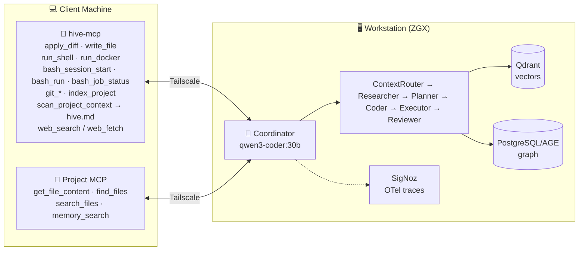

<div align="center">

# 🐝 AGNOHive

**A model-agnostic agentic engineering swarm — 100% local by default, cloud providers available as an explicit opt-in.**

Built on [Agno](https://github.com/agno-agi/agno). Runs on your own workstation, connects to any project over MCP, and coordinates a full engineering team of local agents running on Ollama or vLLM, to read, plan, and write code for you.

[](https://github.com/abehera1992/agno-hive/actions/workflows/hive-mcp.yml)


</div>

---

## ✨ What is it

AGNOHive is a swarm of specialized agents (Researcher, Planner, Coder, Reviewer, …) that connect to your codebase through MCP and get real engineering work done — reading files, planning changes, writing diffs, running commands — all orchestrated by a coordinator model, all running on hardware you control.

- 🔒 **Nothing leaves your network by default** — every model call is local (Ollama or vLLM), every file access is via your own MCP server; cloud providers (OpenAI, Anthropic, Gemini, Perplexity, HuggingFace) are available per-agent behind an explicit `ALLOW_CLOUD_MODELS` opt-in gate, never silently — see [Cloud Model Providers](docs/guide/cloud-models.md)
- 🧠 **Grounded, not guessed** — agents read the actual codebase before answering; a `hive.md` snapshot + LightRAG semantic index keep them from hallucinating structure
- ✅ **Human-in-the-loop by default** — every file write and every external-platform action is staged for your approval before it lands
- 🔌 **Works with any project** — point it at any repo via MCP, no project-specific setup required beyond the connection
- 🔀 **Pluggable inference backend** — Ollama or vLLM + LiteLLM, switchable with one env var, no code changes
- 🗄️ **Ships ready to run** — app storage (sessions, feedback log, model routing) is a local SQLite file by default, zero setup; point `DATABASE_URL` at Postgres/MySQL/anything else if you already run one — see [Cloud Model Providers](docs/guide/cloud-models.md#engine-agnostic-storage-sqlite-by-default)
- 🌳 **Branchable sessions** — every conversation is a tree, not a flat log; rewind and branch with `/tree`, `/branch`, or fork a whole new session with `--fork`
- ⌨️ **Mid-flight steering** — type a follow-up while a run is still streaming; it queues and fires automatically the moment the current run finishes

## 🏗️ How it works



**Two MCP connections per run:** `hive-mcp` (primary — all reads/writes/shell/git/web) and your **project MCP** (supplementary — app-specific tools like `memory_search`). If hive-mcp is unreachable, agents fall back to project MCP automatically; if both are down, the run fails with a clear error.

1. Coordinator's first action is `get_file_content('hive.md')` — grounded context loaded on demand, not pre-injected (prevents models from answering without tool calls)
2. Failure context from past runs is injected into the coordinator's instructions
3. The coordinator routes each operation to the right MCP; member agents see only their scoped tool subset
4. After each run: successes → LightRAG (vector memory), failures → PostgreSQL (failure log), traces → SigNoz

## 📟 A quick look

```
$ hive
AGNOHive  project EkamApp  mode engineering  http://100.96.86.82:9001
  project:   http://100.87.159.1:9000/mcp   + 12ms
  hive-mcp:  http://100.87.159.1:9003/mcp   + 8ms
  resuming session a3f7c2d1  (last used this project)
  /new  /sessions  /history  /persist  /delete <id>  /delete-all  /diff  /cleanup  /plan  /review  /mcp  /tree  /branch <id>  /exit  ·  Ctrl+C to interrupt

> add rate limiting to the login endpoint
  Planning... (ContextRouter → Researcher → Planner)
  ────────────────────────────────────────────────
  1. Researcher: read src/api/auth.py ...
  2. Coder: implement rate limiting using Redis ...
  ────────────────────────────────────────────────
  review pending  src/api/auth.py
  ❯ confirm  — apply this change
    reject   — discard

── 42.3s · session a3f7c2d1 · turn 1 · expires 2026-05-31
```

## 🚀 Quick start

```bash
# 1. On ZGX — clone, install, start infra
git clone <repo-url> ~/agno-hive && cd ~/agno-hive && pip install -r requirements.txt
docker compose -f docker/docker-compose.zgx.yml up -d

# 2. On ZGX — start the servers
python main.py --serve-lightrag &     # LightRAG MCP, :9002
python main.py --serve                # AGNOHive API, :9001

# 3. On your client machine — start hive-mcp
cp hive-mcp/docker-compose.hive.yml . && docker compose -f docker-compose.hive.yml up -d

# 4. Run something
hive "how does authentication work in this project?"
```

New here? Full walkthrough → **[⚙️ Setup Guide](docs/guide/setup.md)**

## 📖 Documentation

| | | |
|---|---|---|
| [⚙️ Setup](docs/guide/setup.md) | [🚀 Running AGNOHive](docs/guide/running.md) | [🖥️ CLI Client](docs/guide/cli.md) |
| [🔌 API Usage](docs/guide/api.md) | [🤖 Agents & Teams](docs/guide/agents-and-teams.md) | [🔧 MCP Tools](docs/guide/mcp-tools.md) |
| [🔗 Integrations](docs/guide/integrations.md) | [🛠️ Development](docs/guide/development.md) | [📚 Full index](docs/guide/README.md) |

## 🤖 The team

| Agent | Model | Role |
|---|---|---|
| Coordinator | `qwen3-coder:30b` | Routes, delegates, synthesises |
| Researcher / Planner / Coder / Reviewer | `qwen2.5-coder:32b` | Read, plan, implement, review |
| ContextRouter / Executor | `llama3.1:8b` | Memory routing, command execution |

Runs on **Ollama** or **vLLM + LiteLLM** — pick one, or set up both and switch with a single env var → **[⚙️ Model serving](docs/guide/setup.md#-model-serving-ollama-or-vllm)**

Full roster, team modes, and the Sprint Master PM team → **[🤖 Agents & Teams](docs/guide/agents-and-teams.md)**

## 🧪 Tests

```bash
pytest tests/ -v
```

---

<div align="center">

Questions about a specific piece? Jump straight to the **[documentation index](docs/guide/README.md)**.

</div>
