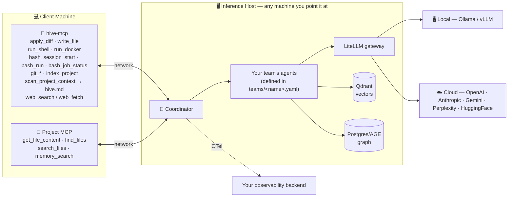

<div align="center">

# 🐝 AGNOHive

**A model-agnostic, fully customizable agentic swarm for your everyday work — local-first, with cloud providers available as an explicit opt-in.**

Built on [Agno](https://github.com/agno-agi/agno). Runs on any machine you point it at, connects to any project over MCP, and coordinates a team of agents — however you configure it — to read, research, plan, and act for you. The `engineering` team shipped as the reference example (research → plan → implement → review) reflects the maintainer's own daily coding workflow; the same framework runs review-only, planning-only, or delivery-board/PM teams just as well — build whatever your day actually needs.

[](https://github.com/abehera1992/agno-hive/actions/workflows/hive-mcp.yml)


</div>

---

## ✨ What is it

AGNOHive is a swarm of specialized agents — whatever roster your team YAML defines — that connect to your project through MCP and get real work done: reading files, researching, planning, implementing, reviewing, running commands, or managing a delivery board, all orchestrated by a coordinator model. The shipped reference teams span all of that (`engineering` for coding, `parallel-review` for read-only review, `planning` for conceptual Q&A, `sprint-master` for PM/delivery-board work) — add your own for anything else.

- 🔒 **Nothing leaves your network by default** — every model call is local (Ollama or vLLM), every file access is via your own MCP server; cloud providers (OpenAI, Anthropic, Gemini, Perplexity, HuggingFace) are available per-agent behind an explicit `ALLOW_CLOUD_MODELS` opt-in gate, never silently — see [Cloud Model Providers](docs/guide/cloud-models.md)
- 🧠 **Grounded, not guessed** — agents read the actual project before answering; a `hive.md` snapshot + LightRAG semantic index keep them from hallucinating structure
- ✅ **Human-in-the-loop by default** — every file write and every external-platform action is staged for your approval before it lands
- 🔌 **Works with any project** — point it at any repo via MCP, no project-specific setup required beyond the connection
- 🔀 **Pluggable inference backend** — Ollama, vLLM, or 5 cloud providers, mixed per-agent, switchable without code changes; any machine can run it — see [how it works](#-how-it-works) below for the local-vs-cloud tradeoff and the one Apple Silicon caveat
- 🗄️ **Ships ready to run** — app storage (sessions, feedback log, model routing) is a local SQLite file by default, zero setup; point `DATABASE_URL` at Postgres/MySQL/anything else if you already run one — see [Cloud Model Providers](docs/guide/cloud-models.md#engine-agnostic-storage-sqlite-by-default)
- 🌳 **Branchable sessions** — every conversation is a tree, not a flat log; rewind and branch with `/tree`, `/branch`, or fork a whole new session with `--fork`
- ⌨️ **Mid-flight steering** — type a follow-up while a run is still streaming; it queues and fires automatically the moment the current run finishes

## 🏗️ How it works



**Two MCP connections per run:** `hive-mcp` (primary — all reads/writes/shell/git/web) and your **project MCP** (supplementary — app-specific tools like `memory_search`). If hive-mcp is unreachable, agents fall back to project MCP automatically; if both are down, the run fails with a clear error.

1. Coordinator's first action is `get_file_content('hive.md')` — grounded context loaded on demand, not pre-injected (prevents models from answering without tool calls)
2. Failure context from past runs is injected into the coordinator's instructions
3. The coordinator routes each operation to the right MCP; member agents see only their scoped tool subset
4. Every model call — coordinator or any agent, local or cloud — resolves per-role through a DB-backed registry and the same LiteLLM gateway, so a team can mix local and cloud providers freely, swappable without touching the team file → [☁️ Cloud Model Providers](docs/guide/cloud-models.md)
5. After each run: successes → LightRAG (vector memory), failures → your app DB (SQLite by default, Postgres/anything else via `DATABASE_URL`), traces → your OTel backend

**Any machine with the right hardware works — this isn't tied to one workstation.** A single powerful local inference box (enough VRAM/unified memory to keep a 20B+ class model resident) unlocks the most headroom: no per-token cost, full data locality, and enough concurrency for a multi-agent pipeline without queueing. A lighter machine works too — route some or all agents to cloud providers instead. **Apple Silicon/MLX isn't supported for local inference yet** — Mac users get the full swarm today via the cloud-provider path.

## 📟 A quick look

```
$ hive
AGNOHive  project myapp  mode engineering  http://<inference-host>:9001
  project:   http://<inference-host>:9000/mcp   + 12ms
  hive-mcp:  http://<inference-host>:9003/mcp   + 8ms
  resuming session a3f7c2d1  (last used this project)
  /new  /sessions  /history  /persist  /delete <id>  /delete-all  /diff  /cleanup  /plan  /review  /mcp  /tree  /branch <id>  /exit  ·  Ctrl+C to interrupt

> add rate limiting to the login endpoint
  Planning... (ContextRouter → Researcher → Planner)
  ────────────────────────────────────────────────
  1. Researcher: read src/api/auth.py ...
  2. Coder: implement rate limiting using Redis ...
  ────────────────────────────────────────────────
  review pending  src/api/auth.py
  ❯ confirm  — apply this change
    reject   — discard

── 42.3s · session a3f7c2d1 · turn 1 · expires 2026-05-31
```

## 🚀 Quick start

```bash
# 1. On your inference host (any machine — see "Any machine with the right hardware
#    works" above; the compose filename below is just this maintainer's own reference
#    environment name, not a requirement) — clone, install, start infra
git clone <repo-url> ~/agno-hive && cd ~/agno-hive && pip install -r requirements.txt
docker compose -f docker/docker-compose.zgx.yml up -d

# 2. On the inference host — start the servers
python main.py --serve-lightrag &     # LightRAG MCP, :9002
python main.py --serve                # AGNOHive API, :9001

# 3. On your client machine — start hive-mcp
cp hive-mcp/docker-compose.hive.yml . && docker compose -f docker-compose.hive.yml up -d

# 4. Run something
hive "how does authentication work in this project?"
```

New here? Full walkthrough → **[⚙️ Setup Guide](docs/guide/setup.md)**

## 📖 Documentation

| | | |
|---|---|---|
| [⚙️ Setup](docs/guide/setup.md) | [🚀 Running AGNOHive](docs/guide/running.md) | [🖥️ CLI Client](docs/guide/cli.md) |
| [🔌 API Usage](docs/guide/api.md) | [🤖 Agents & Teams](docs/guide/agents-and-teams.md) | [🔧 MCP Tools](docs/guide/mcp-tools.md) |
| [🔗 Integrations](docs/guide/integrations.md) | [🛠️ Development](docs/guide/development.md) | [📚 Full index](docs/guide/README.md) |

## 🤖 Reference teams — build your own, or start from these

AGNOHive ships 4 reference teams. None of them is "the" product — swap models per role, add roles, or write an entirely new `teams/<name>.yaml` for whatever your day needs, no code change required.

| Team | What it's for |
|---|---|
| `engineering` | Full research → plan → implement → review pipeline — the maintainer's own daily coding workflow, but the pattern underneath is generic |
| `parallel-review` | Read-only code/security/performance review, 3 reviewers in parallel — never writes |
| `planning` | Conceptual Q&A and plans, no codebase grounding required — general reasoning, not code-specific |
| `sprint-master` | Delivery-board (PM) CRUD — epics, features, tasks, bugs — project management, not code at all |

Every agent's model is DB-managed by default — swap any role between local (**Ollama** / **vLLM + LiteLLM**) and cloud (OpenAI, Anthropic, Gemini, Perplexity, HuggingFace) via `POST /admin/model-routes` + `/reload`, no file edit needed → **[☁️ Cloud Model Providers](docs/guide/cloud-models.md)**

Full roster, team modes, and the Sprint Master PM team in detail → **[🤖 Agents & Teams](docs/guide/agents-and-teams.md)**

## 🧪 Tests

```bash
pytest tests/ -v
```

---

<div align="center">

Questions about a specific piece? Jump straight to the **[documentation index](docs/guide/README.md)**.

</div>
